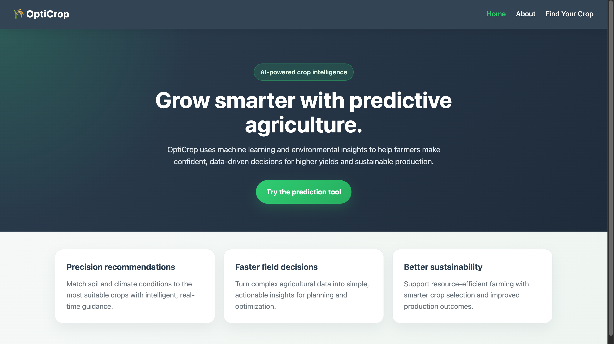
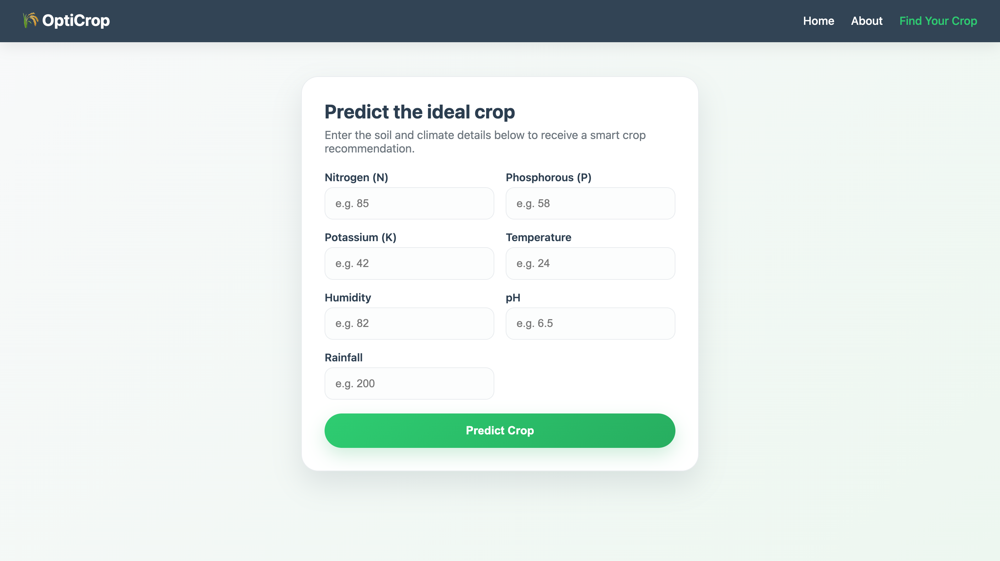
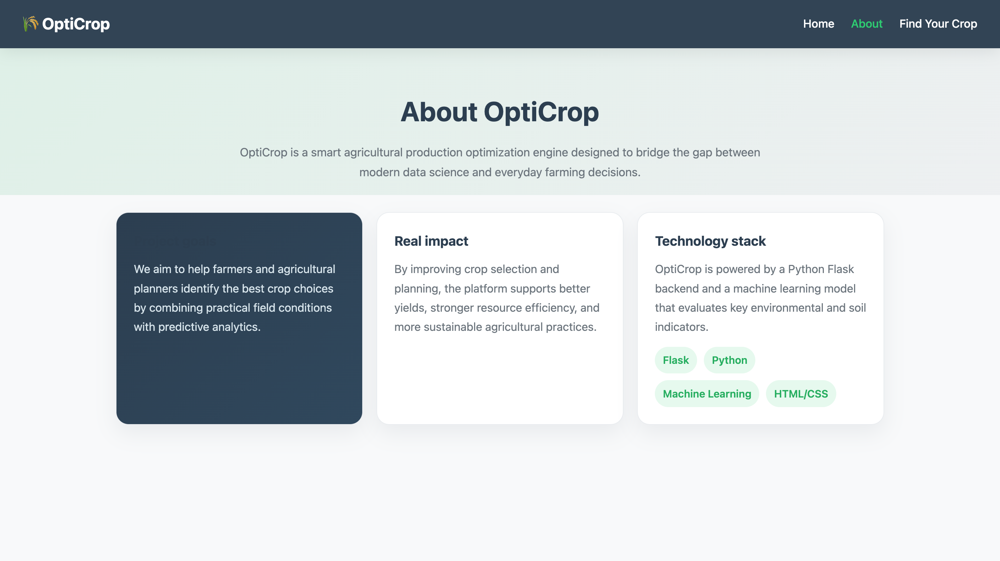

# OptiCrop: Smart Agricultural Production Optimization Engine

OptiCrop is an advanced, data-driven software engine designed to maximize crop yields and resource efficiency for farmers. By integrating and analyzing critical environmental and soil parameters—including Nitrogen (N), Phosphorus (P), Potassium (K), temperature, humidity, soil pH, and rainfall—the platform delivers intelligent, evidence-based recommendations to optimize agricultural production.

---

## 🚀 Key User Scenarios

*   **Scenario 1: Smart Crop Recommendation for Farmers**
    Input soil and environmental details (N, P, K, temperature, humidity, pH, and rainfall) to instantly receive a recommendation for the most suitable crop to plant for maximum productivity.
*   **Scenario 2: Crop Suitability & Environmental Assessment**
    Evaluate whether a specific target crop is compatible with your current local soil and climate parameters before investing in seeds and resources.
*   **Scenario 3: Agricultural Research & Policy Planning**
    Leverage analytical dashboards to study complex crop-environment interactions, helping researchers and policymakers develop sustainable farming and resource optimization strategies.

---

## 🛠️ Tech Stack & Skills

*   **Backend & Framework:** Python, Flask (Web Framework)
*   **Data Analysis & Machine Learning:** NumPy, Pandas, Scikit-learn, SciPy
*   **Data Visualization:** Matplotlib, Seaborn
*   **Frontend:** HTML5, CSS3
  
---

## 🔄 Project Flow & Architecture

The application processes data through the following pipeline:

1. **User Input Interface (Frontend):** 
   The farmer inputs soil parameters (N, P, K, pH) and environmental conditions (temperature, humidity, rainfall) via an HTML5 form (`index.html`).
   
2. **Web Server Handling (Backend):** 
   The Flask application (`app.py`) captures the form data sent via a `POST` request.

3. **Data Pre-processing & Inference (ML Pipeline):** 
   The backend inputs are structured into an array, matched against the pre-trained machine learning model, and processed to output the highest-probability crop recommendation.

4. **Results Delivery (Frontend):** 
   The server renders the results page, dynamically displaying the optimized crop recommendation back to the user.

## 📸 Website Preview

### Home Page

### Predictor

### About

